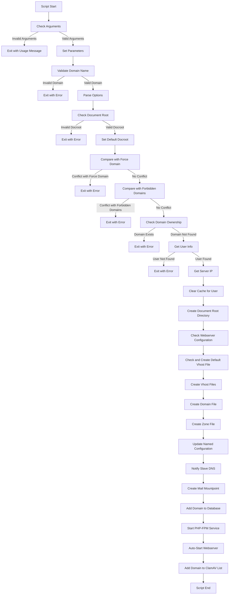

```mermaid
graph TD
    A[Script Start] --> B[Check Arguments]
    B -->|Invalid Arguments| C[Exit with Usage Message]
    B -->|Valid Arguments| D[Set Parameters]
    D --> E[Validate Domain Name]
    E -->|Invalid Domain| F[Exit with Error]
    E -->|Valid Domain| G[Parse Options]
    G --> H[Check Document Root]
    H -->|Invalid Docroot| I[Exit with Error]
    H -->|Valid Docroot| J[Set Default Docroot]
    J --> K[Compare with Force Domain]
    K -->|Conflict with Force Domain| L[Exit with Error]
    K -->|No Conflict| M[Compare with Forbidden Domains]
    M -->|Conflict with Forbidden Domains| N[Exit with Error]
    M -->|No Conflict| O[Check Domain Ownership]
    O -->|Domain Exists| P[Exit with Error]
    O -->|Domain Not Found| Q[Get User Info]
    Q -->|User Not Found| R[Exit with Error]
    Q -->|User Found| S[Get Server IP]
    S --> T[Clear Cache for User]
    T --> U[Create Document Root Directory]
    U --> V[Check Webserver Configuration]
    V --> W[Check and Create Default Vhost File]
    W --> X[Create Vhost Files]
    X --> Y[Create Domain File]
    Y --> Z[Create Zone File]
    Z --> AA[Update Named Configuration]
    AA --> AB[Notify Slave DNS]
    AB --> AC[Create Mail Mountpoint]
    AC --> AD[Add Domain to Database]
    AD --> AE[Start PHP-FPM Service]
    AE --> AF[Auto-Start Webserver]
    AF --> AG[Add Domain to ClamAV List]
    AG --> AH[Script End]
```
